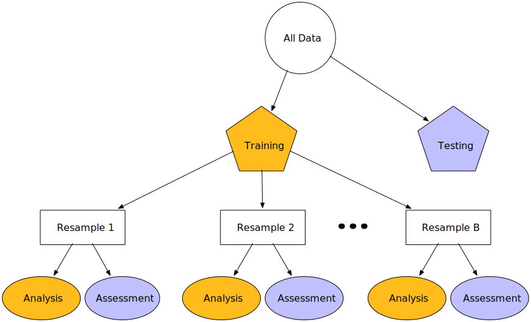
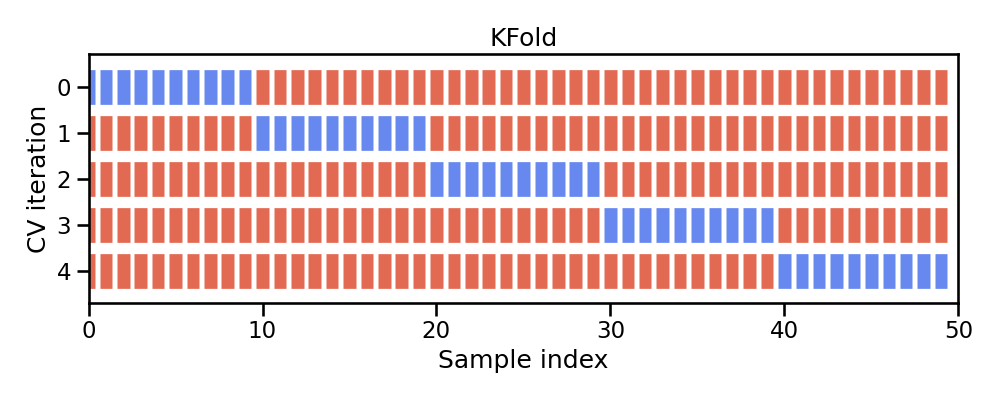
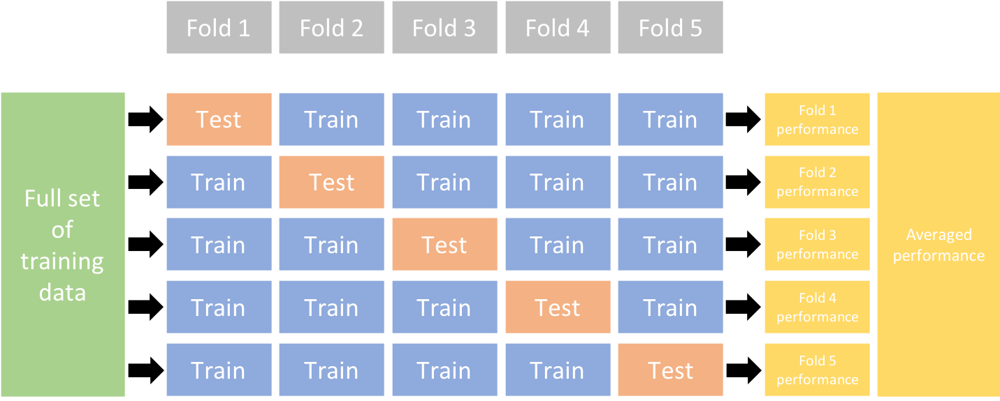
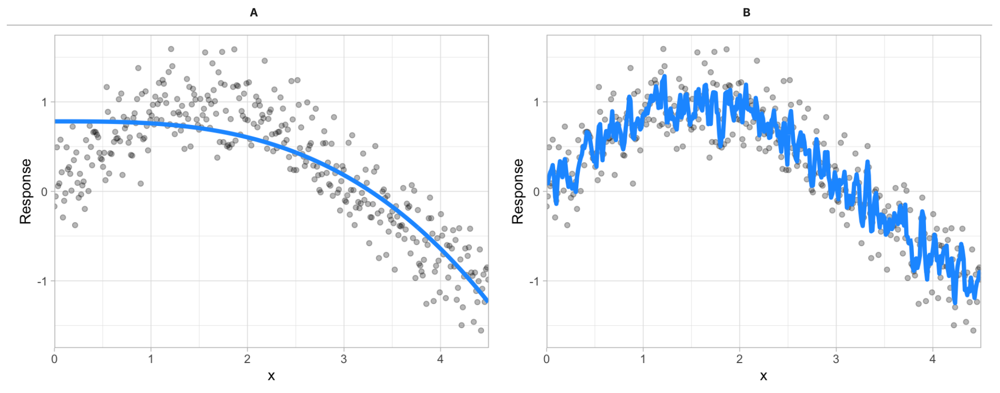

The last few lessons gave you a good introduction to applying Scikit-learn models. This lesson is going to go deeper into the idea of assessing model performance. We'll discuss how to incoporate cross-validation procedures to give you a more robust assessment of model performance. We'll also look at how to incorporate different evaluation metrics for scoring your models. And finally, we will discuss the concept of hyperparameter tuning, the bias-variance tradeoff, and how to implement a tuning strategy to find a model the maximizes generalizability.


## Learning objectives

By the end of this lesson you will be able to:

1. Perform cross-validation procedures for more robust model performance assessment.
2. Apply different evaluation metrics for scoring your model.
3. Execute hyperparameter tuning to find optimal model parameter settings.

## Quick refresher

But first, let's review a few things that we learned in the previous modules.

### Data prep

In lesson 7b we discussed how we typically separate our features and target into distinct data objects and that we create a train-test split so we can measure model performance on data that our model was not trained on.

```{python}
# packages used
import pandas as pd
from sklearn.model_selection import train_test_split

# import data
adult_census = pd.read_csv('../data/adult-census.csv')

# separate feature & target data
target = adult_census['class']
features = adult_census.drop(columns='class')

# drop the duplicated column `"education-num"` as stated in the data exploration notebook
features = features.drop(columns='education-num')

# split into train & test sets
X_train, X_test, y_train, y_test = train_test_split(features, target, random_state=123)
```

### Feature engineering

In lesson 7c we looked at how we can apply common feature engineering tasks to numeric and categorical features and how we can combine these tasks with `ColumnTransformer`.

```{python}
# packages used
from sklearn.compose import make_column_selector as selector
from sklearn.preprocessing import StandardScaler
from sklearn.preprocessing import OneHotEncoder
from sklearn.compose import ColumnTransformer

# create selector object based on data type
numerical_columns_selector = selector(dtype_exclude=object)
categorical_columns_selector = selector(dtype_include=object)

# get columns of interest
numerical_columns = numerical_columns_selector(features)
categorical_columns = categorical_columns_selector(features)

# preprocessors to handle numeric and categorical features
numerical_preprocessor = StandardScaler()
categorical_preprocessor = OneHotEncoder(handle_unknown="ignore")

# transformer to associate each of these preprocessors with their respective columns
preprocessor = ColumnTransformer([
    ('one-hot-encoder', categorical_preprocessor, categorical_columns),
    ('standard_scaler', numerical_preprocessor, numerical_columns)
])
```

### Modeling

And we also discussed how we can combine feature engineering steps with modeling steps using a pipeline object. 

```{python}
# packages used
from sklearn.linear_model import LogisticRegression
from sklearn.pipeline import make_pipeline

# Pipeline object to chain together modeling processes
model = make_pipeline(preprocessor, LogisticRegression(max_iter=500))
model

# fit our model
_ = model.fit(X_train, y_train)

# score on test set
model.score(X_test, y_test)
```

## Resampling & cross-validation

In lesson 7b we split our data into training and testing sets and we assessed the performance of our model on the test set. Unfortunately, there are a few pitfalls to this approach:

1. If our dataset is small, a single test set may not provide realistic expectations of our model's performance on unseen data.
2. A single test set does not provide us any insight on variability of our model's performance.
3. Using our test set to drive our model building process can bias our results via _data leakage_.

Resampling methods provide an alternative approach by allowing us to repeatedly fit a model of interest to parts of the training data and test its performance on other parts of the training data.

:::{figure-md} resampling


Illustration of resampling.
:::

```{note}
This allows us to train and validate our model entirely on the training data and not touch the test data until we have selected a final "optimal" model.
```

The two most commonly used resampling methods include ___k-fold cross-validation___ and ___bootstrap sampling___. This lesson focuses on using k-fold cross-validation.

## K-fold cross-validation

Cross-validation consists of repeating the procedure such that the training and testing sets are different each time. Generalization performance metrics are collected for each repetition and then aggregated. As a result we can get an estimate of the variability of the model’s generalization performance.

_k_-fold cross-validation (aka _k_-fold CV) is a resampling method that randomly divides the training data into _k_ groups (aka folds) of approximately equal size. 

:::{figure-md} kfold


Illustration of k-fold sampling across a data sets index.
:::

The model is fit on $k-1$ folds and then the remaining fold is used to compute model performance.  This procedure is repeated _k_ times; each time, a different fold is treated as the validation set. 

This process results in _k_ estimates of the generalization error (say $\epsilon_1, \epsilon_2, \dots, \epsilon_k$). Thus, the _k_-fold CV estimate is computed by averaging the _k_ test errors, providing us with an approximation of the error we might expect on unseen data.

:::{figure-md} kfold-2


Illustration of a 5-fold cross validation procedure.
:::

In scikit-learn, the function [`cross_validate`](https://scikit-learn.org/stable/modules/generated/sklearn.model_selection.cross_validate.html) allows us to perform cross-validation and you need to pass it the model, the data, and the target. Since there exists several cross-validation strategies, cross_validate takes a parameter `cv` which defines the splitting strategy.

```{tip}
In practice, one typically uses k=5 or k=10. There is no formal rule as to the size of k; however, as k gets larger, the difference between the estimated performance and the true performance to be seen on the test set will decrease.
```

```{python}
#| slideshow: {slide_type: slide}
#| tags: []
%%time
from sklearn.model_selection import cross_validate

cv_result = cross_validate(model, X_train, y_train, cv=5)
cv_result
```

The output of cross_validate is a Python dictionary, which by default contains three entries: 

- `fit_time`: the time to train the model on the training data for each fold, 
- `score_time`: the time to predict with the model on the testing data for each fold, and 
- `test_score`: the default score on the testing data for each fold.

```{python}
#| slideshow: {slide_type: slide}
#| tags: []
scores = cv_result["test_score"]
print("The mean cross-validation accuracy is: "
      f"{scores.mean():.3f} +/- {scores.std():.3f}")
```

### Knowledge check

```{admonition} Question:
Using `KNeighborsClassifier()`, run a 5 fold cross validation procedure and compare the accuracy and standard deviation to the `LogisticRegression` model we just ran. Which model has a better CV score?
```

## Evaluation metrics

Evaluation metrics allow us to measure the predictive accuracy of our model – the difference between the predicted value ($\hat{y}_i$) and the actual value ($y_i$).

We often refer to evaluation metrics as ___loss functions___: $f(y_{i} - \hat{y}_i)$

Scikit-Learn provides multiple ways to compute evaluation metrics and refers to this concept as [___scoring___](https://scikit-learn.org/stable/modules/model_evaluation.html). 
   1. Estimator scoring method
   2. Individual scoring functions
   3. Scoring parameters

### Estimator scoring method

Every estimator (regression/classification model) has a default scoring method. Most classifiers return the mean accuracy of the model on the supplied $X$ and $y$:

```{python}
#| slideshow: {slide_type: fragment}
#| tags: []
# toy data
from sklearn.datasets import load_breast_cancer
X_cancer, y_cancer = load_breast_cancer(return_X_y=True)

# fit model
clf = LogisticRegression(solver='liblinear').fit(X_cancer, y_cancer)

# score
clf.score(X_cancer, y_cancer)
```

While most regressors return the $R^2$ metric:

```{python}
# toy data
from sklearn.datasets import load_diabetes
X_diabetes, y_diabetes = load_diabetes(return_X_y=True)

# fit model
from sklearn.linear_model import LinearRegression
reg = LinearRegression().fit(X_diabetes, y_diabetes)

# score
reg.score(X_diabetes, y_diabetes)
```

### Individual scoring functions

However, these default evaluation metrics are often not the metrics most suitable to the business problem.

There are many loss functions to choose from; each with unique characteristics that can be beneficial for certain problems.
   * Regression problems
      - Mean squared error (MSE)
      - Root mean squared error (RMSE)
      - Mean absolute error (MAE)
      - etc.
   * Classification problems
      - Area under the curve (AUC)
      - Cross-entropy (aka Log loss)
      - Precision
      - etc.

Scikit-Learn provides many [scoring functions](https://scikit-learn.org/stable/modules/classes.html#module-sklearn.metrics) to choose from.

```{python}
from sklearn import metrics
```

The functions take actual y values and predicted y values -- $f(y_{i} - \hat{y}_i)$

__Example regression metrics__:

```{python}
y_pred = reg.predict(X_diabetes)

# Mean squared error
metrics.mean_squared_error(y_diabetes, y_pred)
```

```{python}
#| slideshow: {slide_type: fragment}
#| tags: []
# Mean absolute percentage error
metrics.mean_absolute_percentage_error(y_diabetes, y_pred)
```

__Example classification metrics__:

```{python}
y_pred = clf.predict(X_cancer)

# Area under the curve
metrics.roc_auc_score(y_cancer, y_pred)
```

```{python}
#| slideshow: {slide_type: fragment}
#| tags: []
# F1 score
metrics.f1_score(y_cancer, y_pred)
```

```{python}
#| slideshow: {slide_type: fragment}
#| tags: []
# multiple metrics at once!
print(metrics.classification_report(y_cancer, y_pred))
```

### Scoring parameters

And since we prefer to use cross-validation procedures, scikit-learn has incorporated a `scoring` parameter.

Most evaluation metrics have a predefined text string that can be supplied as a `scoring` argument. 

```{python}
# say we wanted to use AUC as our loss function while using 5-fold validation
cross_validate(model, X_train, y_train, cv=5, scoring='roc_auc')
```

```{note}
The unified scoring API in scikit-learn always <u>maximizes</u> the score, so metrics which need to be minimized are negated in order for the unified scoring API to work correctly. Consequently, some metrics such as `mean_squared_error()` will use a predefined text string starting with <b>neg_</b> (i.e. 'neg_mean_squared_error').
```

```{python}
#| slideshow: {slide_type: fragment}
#| tags: []
# applying mean squared error in a regression k-fold cross validation procedure
cross_validate(reg, X_diabetes, y_diabetes, cv=5, scoring='neg_root_mean_squared_error')
```

You can even supply [more than one metric](https://scikit-learn.org/stable/modules/model_evaluation.html#using-multiple-metric-evaluation) or even [define your own custom metric](https://scikit-learn.org/stable/modules/model_evaluation.html#defining-your-scoring-strategy-from-metric-functions).

```{python}
# example of supplying more than one metric
metrics = ['accuracy', 'roc_auc']

cross_validate(model, X_train, y_train, cv=5, scoring=metrics)
```

### Knowledge check

```{admonition} Questions:
:class: attention
Using the `KNeighborsClassifier()` from the previous <b>Knowledge check</b> exercise, perform a 5 fold cross validation and compute the accuracy <u><b>and</b></u> ROC AUC.
```

## Hyperparameter tuning

Given two different models (blue line) to the same data (gray dots), which model do you prefer?

:::{figure-md} bias-variance-comparison


Between model A and B, which do you think is better?
:::

The image above illustrates the fact that prediction errors can be decomposed into two main subcomponents we care about:

- error due to “bias”
- error due to “variance”

### Bias

Error due to ___bias___ is the difference between the expected (or average) prediction of our model and the correct value which we are trying to predict.

It measures how far off in general a model’s predictions are from the correct value, which provides a sense of how well a model can conform to the underlying structure of the data.

High bias models (i.e. generalized linear models) are rarely affected by the noise introduced by new unseen data

:::{figure-md} bias-models


A biased polynomial model fit to a single data set does not capture the underlying non-linear, non-monotonic data structure (left). Models fit to 25 bootstrapped replicates of the data are underterred by the noise and generates similar, yet still biased, predictions (right).
:::

### Variance

Error due to ___variance___ is the variability of a model prediction for a given data point.

Many models (e.g., k-nearest neighbor, decision trees, gradient boosting machines) are very adaptable and offer extreme flexibility in the patterns that they can fit to. However, these models offer their own problems as they run the risk of overfitting to the training data. 

Although you may achieve very good performance on your training data, the model will not automatically generalize well to unseen data.

:::{figure-md} variance-models


A high variance k-nearest neighbor model fit to a single data set captures the underlying non-linear, non-monotonic data structure well but also overfits to individual data points (left). Models fit to 25 bootstrapped replicates of the data are deterred by the noise and generate highly variable predictions (right).
:::

```{note}
Many high performing models (i.e. random forests, gradient boosting machines, deep learning) are very flexible in the patterns they can conform to due to the many hyperparameters they have. However, this also means they are prone to overfitting (aka can have high variance error).
```

___Hyperparameters___ (aka tuning parameters) are the "knobs to twiddle" to control the complexity of machine learning algorithms and, therefore, the ___bias-variance trade-off___.

Some models have very few hyperparameters. For example in a K-nearest neighbor (KNN) model ___K___ (the number of neighbors) is the primary hyperparameter.

:::{figure-md} knn-tuned


k-nearest neighbor model with differing values for k.
:::

While other models such as gradient boosted machines (GBMs) and deep learning models can have many.

___Hyperparameter tuning___ is the process of screening hyperparameter values (or combinations of hyperparameter values) to find a model that balances bias & variance so that the model generalizes well to unseen data.

```{python}
#| slideshow: {slide_type: fragment}
#| tags: []
%%time
import numpy as np
from sklearn.neighbors import KNeighborsClassifier
from sklearn.model_selection import cross_val_score

# set hyperparameter in KNN model
model = KNeighborsClassifier(n_neighbors=10)

# create preprocessor & modeling pipeline
pipeline = make_pipeline(preprocessor, model)

# 5-fold cross validation using AUC error metric
results = cross_val_score(pipeline, X_train, y_train, cv=5, scoring='roc_auc')

print(f'KNN model with 10 neighbors: AUC = {np.mean(results):.3f}')
```

But what if we wanted to assess and compare `n_neighbors` = 5, 10, 15, 20, ... ?

### Full cartesian grid search

For this we could use a ___full cartesian grid search___ using Scikit-Learn's `GridSearchCV()`:

```{python}
#| slideshow: {slide_type: fragment}
#| tags: []
%%time
from sklearn.model_selection import GridSearchCV
from sklearn.pipeline import Pipeline

# basic model object
knn = KNeighborsClassifier()

# Create grid of hyperparameter values
hyper_grid = {'knn__n_neighbors': [5, 10, 15, 20]}

# create preprocessor & modeling pipeline
pipeline = Pipeline([('prep', preprocessor), ('knn', knn)])

# Tune a knn model using grid search
grid_search = GridSearchCV(pipeline, hyper_grid, cv=5, scoring='roc_auc', n_jobs=-1)
results = grid_search.fit(X_train, y_train)

# Best model's cross validated AUC
abs(results.best_score_)
```

```{tip}
We use `Pipeline` rather than `make_pipeline` in the above because it allows us to name the different steps in the pipeline. This allows us to assign hyperparameters to distinct steps within the pipeline.
```

```{python}
results.best_params_
```

### Random search

However, a cartesian grid-search approach has limitations. 

* It does not scale well when the number of parameters to tune is increasing.
* It also forces regularity rather than aligning values assessed to distributions.

:::{figure-md} random-search


Random search compared to standard grid search.
:::

```{note}
Random search based on hyperparameter distributions has proven to perform as well, if not better than, standard grid search. Learn more <a href="http://jmlr.csail.mit.edu/papers/volume13/bergstra12a/bergstra12a.pdf">here</a>.
```

For example, say we want to train a random forest classifier. Random forests are very flexible algorithms and can have _several_ hyperparameters. 

```{python}
#| slideshow: {slide_type: fragment}
#| tags: []
from sklearn.ensemble import RandomForestClassifier

# basic model object
rf = RandomForestClassifier(random_state=123)

# create preprocessor & modeling pipeline
pipeline = Pipeline([('prep', preprocessor), ('rf', rf)])
```

For this particular random forest algorithm we'll assess the following hyperparameters. Don't worry if you are not familiar with what these do.

* `n_estimators`: number of trees in the forest,
* `max_features`: number of features to consider when looking for the best split,
* `max_depth`: maximum depth of each tree built,
* `min_samples_leaf`: minimum number of samples required in a leaf node,
* `max_samples`: number of samples to draw from our training data to train each tree.

A standard grid search would be very computationally intense.

Instead, we'll use a random latin hypercube search using [`RandomizedSearchCV`](https://scikit-learn.org/stable/modules/generated/sklearn.model_selection.RandomizedSearchCV.html).

To build our grid, we need to specify distributions for our hyperparameters.

```{tip}
`scipy.stats.loguniform` can be used to generate floating numbers. To generate random values for integer-valued parameters (e.g. `min_samples_leaf`) we can adapt is as follows:
```

```{python}
#| slideshow: {slide_type: skip}
#| tags: []
from scipy.stats import loguniform


class loguniform_int:
    """Integer valued version of the log-uniform distribution"""
    def __init__(self, a, b):
        self._distribution = loguniform(a, b)

    def rvs(self, *args, **kwargs):
        """Random variable sample"""
        return self._distribution.rvs(*args, **kwargs).astype(int)
```

```{python}
#| slideshow: {slide_type: slide}
#| tags: []
# specify hyperparameter distributions to randomly sample from
param_distributions = {
    'rf__n_estimators': loguniform_int(50, 1000),
    'rf__max_features': loguniform(.1, .5),
    'rf__max_depth': loguniform_int(4, 20),
    'rf__min_samples_leaf': loguniform_int(1, 100),
    'rf__max_samples': loguniform(.5, 1),
}
```

Now, we can define the randomized search using the different distributions. 

Executing 10 iterations of 5-fold cross-validation for random parametrizations of this model on this dataset can take from 10 seconds to several minutes, depending on the speed of the host computer and the number of available processors.

```{python}
%%time
from sklearn.model_selection import RandomizedSearchCV

# perform 10 random iterations
random_search = RandomizedSearchCV(
    pipeline,
    param_distributions=param_distributions,
    n_iter=10,
    cv=5,
    scoring='roc_auc',
    verbose=1,
    n_jobs=-1,
)

results = random_search.fit(X_train, y_train)
```

```{python}
#| slideshow: {slide_type: slide}
#| tags: []
results.best_score_
```

```{python}
results.best_params_
```

## Exercises

```{admonition} Questions:
:class: attention
Import the dataset blood_transfusion.csv:

1. The column “Class” contains the target variable. Investigate this variable. Is this a regression or classification problem?
2. Why is it relevant to add a preprocessing step to scale the data using a `StandardScaler` when working with a `KNeighborsClassifier`?
3. Create a scikit-learn pipeline (using `sklearn.pipeline.make_pipeline`) where a `StandardScaler` will be used to scale the data followed by a `KNeighborsClassifier`. Use the default hyperparameters. Inspect the parameters of the created pipeline. What is the value of K, the number of neighbors considered when predicting with the k-nearest neighbors?
4. Perform a 5-fold cross validation with the pipeline you created in #3. What is your average CV score?
5. Now perform hyperparameter tuning to understand the effect of the parameter `n_neighbors` on the model score. Use the following values for the parameter range. Again, perform a 5-fold cross validation. Which hyperparameter value performed the best and what was the CV score?
    ```python
    param_range = [1, 2, 5, 10, 20, 50, 100, 200, 500]
    
```

## Computing environment

```{python}
%load_ext watermark
%watermark -v -p jupyterlab,pandas,sklearn
```

