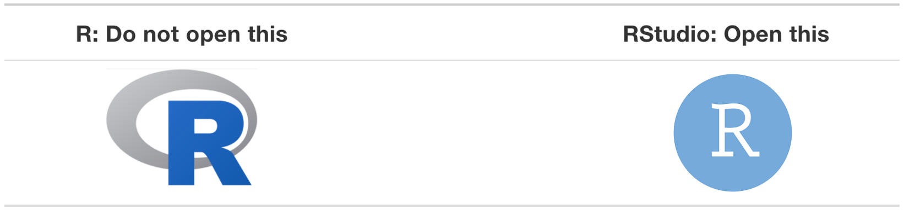
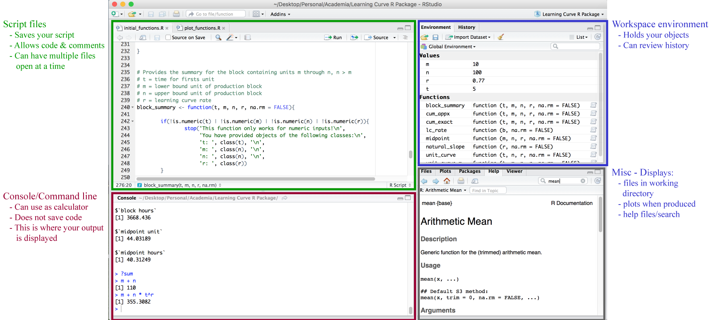

```{r setup, include=FALSE, cache=FALSE}
# Set global R options
options(htmltools.dir.version = FALSE, servr.daemon = TRUE)

# Set global knitr chunk options
knitr::opts_chunk$set(
  fig.align = "center", 
  cache = TRUE,
  error = FALSE,
  message = FALSE, 
  warning = FALSE, 
  collapse = TRUE 
)

# This is good for getting the ggplot background consistent with
# the html background color
library(ggplot2)
thm <- theme_bw()
theme_set(thm)
```

class: clear, middle


background-image: url(../../images/title-slide-lesson-1b.jpg)
background-position: center
background-size: cover

<br><br><br>

.pull-left-wide[
.font300.white[Lesson 1b] <br>
.font200.white[Up and running with R and RStudio]
]

---

# Learning objectives

<br>

.font120[
- Understand the difference between R and RStudio.

- Have R and RStudio installed on your computer.

- Be able to navigate the RStudio IDE.

- Know how to get help as you first start learning R.

- Differentiate errors, warnings, and messages.

- Know what additional resources are available to go deeper.
]

---
class: clear, middle

```{r r-vs-rstuio, echo=FALSE}
knitr::include_graphics("../../images/R_vs_RStudio_1.png")
```

.center[_"R is like a car’s engine while RStudio is like a car’s dashboard...just as the way of having access to a speedometer, rearview mirrors, and a navigation system makes driving much easier, using RStudio’s interface makes using R much easier as well."_ - Ismay and Kim (2019)]

---

# Installing R and RStudio

.pull-left[

### R (programming language) `r fontawesome::fa("r-project", fill = "steelblue")`

1. Go to https://cloud.r-project.org/
2. Select the installer for your operating system:
3. Follow the instructions of the installer.  

]

.pull-right[

### RStudio (IDE) 

1. Go to RStudio for desktop https://www.rstudio.com/products/rstudio/download/
2. Scroll down to “Installers for Supported Platforms” near the bottom of the page.
3. Select the install file for your OS
4. Follow the instructions of the installer  

]

<br><br><br>

.center[
.content-box-gray[.bold[You should have R version 4.0.0 or greater and RStudio version 2022.02.1 or greater installed.]]
]

---
# Use the right icon! <div style="float: right;">`r fontawesome::fa("laptop-code", position='right')`</div>

<br><br>

```{r r-vs-rstudio-icons, echo=FALSE, fig.align='center'}

```

<br>

.center[
.content-box-red-dark[.font.white.bold[Use the RStudio icon (right) and not the R icon (left) to launch your R project.]]
]

---

# Understanding the RStudio IDE <div style="float: right;">`r fontawesome::fa("laptop-code", position='right')`</div>

```{r rstudio-console-notation, echo=FALSE}

```

---
class: yourturn

# Exercises <div style="float: right;">`r fontawesome::fa("laptop-code", position='right')`</div>

<br>

1. Identify which working directory you are working out of.

2. Create a folder on your computer titled _Learning R_. Within RStudio, set your working directory to this folder.

3. Type `pi` in the console. Set the option to show 8 digits. Re-type `pi` in the console.

4. Type `?pi` in the console. Note that documentation on this object pops up in the Help tab in the Misc. Display.

5. Now check out your code History tab.

6. Create a new .R file and save this as _my-first-script_ (note how this now appears in your _Learning R_ folder). Type `pi` in line 1 of this script, `option(digits = 8)` in line 2, and `pi` again in line three. Execute this code one line at a time and then re-execute all lines at once.

---

# Getting Help

.pull-left[

### In general

* __Google__: just add "with R" at the end of any search
* __Stack Overflow__: focused on programming questions
* __Cross Validated__: focused on statistical questions
* __RStudio Community__: a community for all things R and RStudio.

### FOMO

* __R-bloggers__: blog aggregator
* __Twitter__: #rstats

]

--

.pull-right[

### Within R

```{r, eval=FALSE}
# provides details for specific function
help(sqrt)
?sqrt #<<

# provides examples for said function
example(sqrt)
```


]

---
class: yourturn

# Exercises <div style="float: right;">`r fontawesome::fa("laptop-code", position='right')`</div>

<br><br><br>

1. Does `help.start()` provide a link to an introduction to R manual?

2. Does R's `mode` function compute the statistical mode?

3. Review at least 5 [Stack Overflow questions about R](https://stackoverflow.com/questions/tagged/r).

---

# .red[Errors], .yellow[warnings], and .green[messages]

<br><br><br><br><br>
.center.font180[You will get them so learn to embrace them!]

---

# .red[Errors].opacity10[, warnings, and messages]

.pull-left[
- Prefaced with "Error in..."

- Will try to explain what went wrong

- Generally the code will not run
]

.pull-right[

```{r stop-light, echo=FALSE, out.height='50%', out.width='50%'}

```

]

<br>
```{r, error=TRUE}
# Example of an error
1 + 'a'
```

---

# .opacity10[Errors,] .yellow[warnings].opacity10[, and messages]

.pull-left[
- Prefaced with "Warning:"

- R will try to explain why there’s a warning. 

- Generally your code will still work, but with some caveats.
]

.pull-right[

```{r, echo=FALSE, out.height='50%', out.width='50%'}

```

]

<br>
```{r, warning=TRUE}
# Example of a warning
x <- 1:2
y <- 1:3

x + y
```

---

# .opacity10[Errors, warnings, and] .green[messages]

.pull-left[
- Doesn’t start with “Error” nor “Warning”

- General communication to the user but everything is fine! 

- Keep on coding!

]

.pull-right[

```{r, echo=FALSE, out.height='50%', out.width='50%'}

```

]

<br>

```{r, eval=FALSE}
# Example of a message
library(completejourney)
## Welcome to the completejourney package! Learn more about these data
## sets at http://bit.ly/completejourney.
```

---
class: yourturn

# Exercises <div style="float: right;">`r fontawesome::fa("laptop-code", position='right')`</div>

<br><br>

1. What differentiates R and RStudio?

2. What are the four main panes in RStudio?

3. What function tells you what directory your are operating in?

4. How could you change the directory to a new folder?

5. How could you access R documentation to learn more about the `lm()` function?

---

# Questions before moving on?

<br>

```{r questions-fundamentals, echo=FALSE, out.height="450", out.width="450"}
knitr::include_graphics("../../images/questions.png")
```
