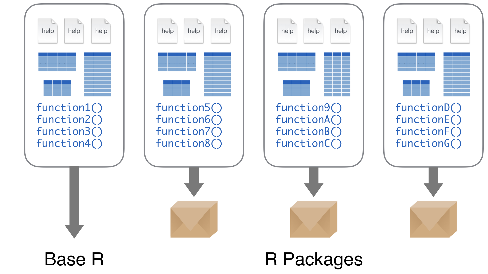
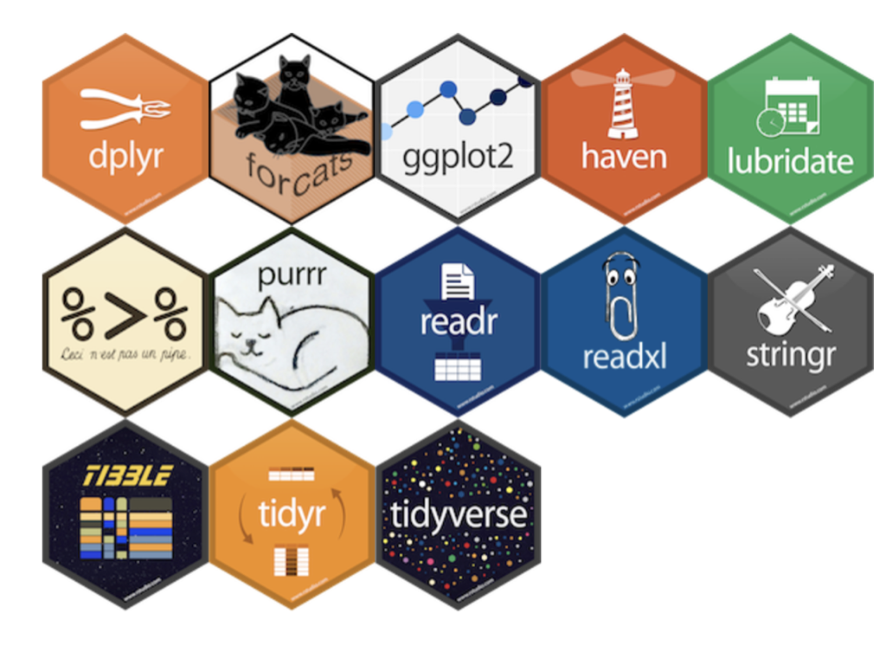
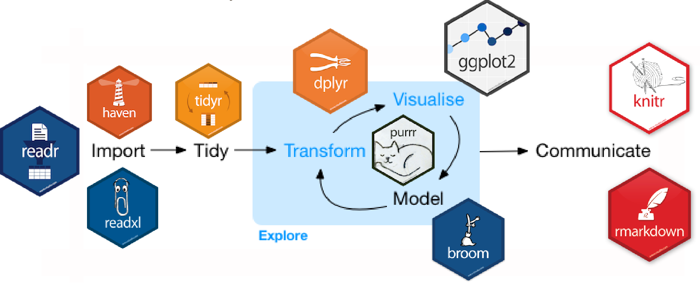

```{r setup, include=FALSE, cache=FALSE}
# Set global R options
options(htmltools.dir.version = FALSE, servr.daemon = TRUE)

# Set global knitr chunk options
knitr::opts_chunk$set(
  fig.align = "center", 
  error = FALSE,
  message = FALSE, 
  warning = FALSE, 
  collapse = TRUE 
)

# This is good for getting the ggplot background consistent with
# the html background color
library(ggplot2)
thm <- theme_bw()
theme_set(thm)

options(digits = 5)
```

class: clear, middle


background-image: url(../../images/title-slide-lesson-1c.png)
background-position: center
background-size: cover

<br><br><br>

.pull-left-wide[
.font300.white[Lesson 1c] <br>
.font200.white[R Fundamentals]
]

---

# Learning objectives

<br>

.font120[
- Assign values to variables and evaluate them.

- Perform basic mathematical operations.

- Understand the idea of vectorization.

- Explain what packages and be able to install and load them.

- Understand and apply basic styling guidelines to your code.
]

---

# Assignment & Evaluation <div style="float: right;">`r fontawesome::fa("laptop-code", position='right')`</div>

.pull-left[

### Assignment

```{r}
# idiomatic assignment
x <- 3
```

]

--

.pull-right[

### Evaluation

```{r}
x
```

]

---

# Assignment & Evaluation <div style="float: right;">`r fontawesome::fa("laptop-code", position='right')`</div>

.pull-left[

### Assignment

```{r}
# idiomatic assignment
x <- 3

# non-idiomatic but works
y = 4
```

]

.pull-right[

### Evaluation

```{r}
x

y
```

]

---

# Assignment & Evaluation <div style="float: right;">`r fontawesome::fa("laptop-code", position='right')`</div>

.pull-left[

### Assignment

```{r}
# idiomatic assignment
x <- 3

# non-idiomatic but works
y = 4

# keep case-sensitivity in mind
Z <- 5
```

]

.pull-right[

### Evaluation

```{r, error=TRUE}
x

y

z
```

]

---

# Assignment & Evaluation <div style="float: right;">`r fontawesome::fa("laptop-code", position='right')`</div>

<br><br>

.pull-left[

```{r}
# original value
x <- 3
x

# we can always overwrite values
x <- 6
x
```

]

.pull-right[

```{r}
# or even do multiple assignment at once
x <- y <- z <- 18

x
y
z
```

]

---
class: yourturn

# Exercises

1. Assign the value 5 to variable `x` (note how this shows up in your Global Environment).

2. Assign the character "abc" to variable `y`.

3. Evaluate the value of `x` and `y` at in the console.

4. Now use the `rm()` function to remove these objects from you working environment.

---

# R as a calculator `r anicon::faa("calculator", animate = 'pulse', speed = 'slow', anitype="hover", color='red')` <div style="float: right;">`r fontawesome::fa("laptop-code", position='right')`</div>

.pull-left[

1. **P**arentheses

2. **E**xponentiation

3. **M**ultiplication and **D**ivision

4. **A**ddition and **S**ubtraction

]

.pull-right[
```{r}
# uses PEMBDAS convention for order of operations
4 + 3 / 10 ^ 2

(4 + 3) / 10 ^ 2

(4 + 3 / 10) ^ 2
```
]

---

# R as a calculator `r anicon::faa("calculator", animate = 'pulse', speed = 'slow', anitype="hover", color='red')` <div style="float: right;">`r fontawesome::fa("laptop-code", position='right')`</div>

.pull-left[

1. **P**arentheses

2. **E**xponentiation

3. **M**ultiplication and **D**ivision

4. **A**ddition and **S**ubtraction

We can even due integer & modulo division. See all the arithmetic operators with `?Arithmetic`.

]

.pull-right[
```{r}
# uses PEMBDAS convention for order of operations
4 + 3 / 10 ^ 2

(4 + 3) / 10 ^ 2

(4 + 3 / 10) ^ 2

# integer division #<<
42 %/% 4 #<<

# modulo (remainder) #<<
42 %% 4 #<<
```
]

---

# Number lengths

.pull-left[

Sometimes we'll get large numbers expressed in scientific notation

If this bothers you, you can always adjust the digit length

]

.pull-right[

```{r large-numbers}
888888 * 888888

options(digits = 10)
888888 * 888888
```

]

---

# Number lengths

.pull-left[

Sometimes we'll get large numbers expressed in scientific notation

If this bothers you, you can always adjust the digit length

But there is a limit

]

.pull-right[

```{r, error=TRUE}
pi

options(digits = 22)
pi

options(digits = 23)
```

]

--

<br><br><br>
.center[
.content-box-red-dark[.bold.white[We'll see that in regular data analysis, some of the R data structures takes care of this for us.]]
]

```{r, echo=FALSE}
options(digits = 7)
```

---

# Miscellaneous mathematical functions

.pull-left[

There are many built-in functions to be aware of. These include but are not limited to the following.

You can see all the various math operators with `?methods::Math`
]

.pull-right[

```{r}
x <- 10

# absolute value
abs(x)

# square root
sqrt(x) 

# exponential transformation
exp(x)

# logarithmic transformation
log(x)      

# cosine and other trigonometric functions
cos(x)
```

]

---

# `NA`, `Inf`, and `NaN` numbers

.pull-left[

R uses a few different objects to indicate:

- Missing values with `NA`

- Infinity with `Inf`

- Not a Number with `NaN`

]

.pull-right[

```{r, warning=TRUE}
# calculations with NA produces NA
4 + 3 / 10 ^ NA

# infinity
1 / 0

# not a number
0 / 0

# square root of -9
sqrt(-9)
```

]

<br>

--
.center.content-box[These can easily pop up in regular data wrangling tasks and later modules will discuss how to work with these types of outputs along with missing values.]

---
class: yourturn

# Exercises

<br><br>

1. Assign the values 1000, 5, and 0.05 to variables `D`, `K`, and `h` respectively.

2. Compute $2 \times D \times K$.

3. Compute $\frac{2 \times D \times K}{h}$.

4. Now put this together to compute the Economic Order Quantity, which is $\sqrt{\frac{2 \times D \times K}{h}}$. Save the output as `Q`.

---

# R has built-in vectorization

.pull-left[

Say you have the following two vectors and we want to add them element-wise:

```{r}
x <- c(1, 3, 4)
y <- c(1, 2, 4)

x

y
```

]

--

.pull-right[

In many languages you would need to apply a `for` loop mechanism to do so:

```{r}
z <- as.vector(NULL)

# `for` loop to add corresponding elements in each vector
for (i in seq_along(x)) {
        z[i] <- x[i] + y[i]
}

z
```

]

---

# R has built-in vectorization

.pull-left[

Say you have the following two vectors and we want to add them element-wise:

```{r}
x <- c(1, 3, 4)
y <- c(1, 2, 4)

x

y
```

]

.pull-right[

But in R, many functions are already ___vectorized___, which mean they can operate on entire vectors at once.

```{r}
# add each element in x and y
x + y

# multiply each element in x and y
x * y

# compare each element in x to y
x > y
```


]

---
# Recycling

.pull-left[
Moreover, the flexibility of vectorized functions allow us to easily perform tasks like this where we iterate over each element of `x` and add `y`

```{r}
x <- c(1, 2, 3, 4)
y <- 1

x + 1
```

.center.content-box[This is called ___recycling___]

]

--

.pull-right[

We can use different length vectors...

```{r}
long <- 1:10
short <- 1:5

long + short
```

But we should be careful when performing recycling!

```{r, warning=TRUE}
even_length <- 1:10
odd_length <- 1:3

even_length + odd_length
```


]

---
class: yourturn

# Exercises

1. Create this vector `my_vec <- 1:10`.

2. Add 1 to every element in `my_vec`.

3. Divide every element in `my_vec` by 2.

4. Create a second vector `my_vec2 <- 10:18` and add `my_vec` to `my_vec2`.

---

# Working with packages `r emo::ji("package")`

The fundamental unit of shareable code is the .bold[package].

* CRAN: ~19,000+
* Bioconductor: ~2,00
* GitHub: Many more plus beta versions for updated packages not yet published

```{r, echo=FALSE, out.width="60%"}

```

---

# Working with packages `r emo::ji("package")`

The fundamental unit of shareable code is the .bold[package].

* CRAN: ~19,000+
* Bioconductor: ~2,00
* GitHub: Many more plus beta versions for updated packages not yet published

.blue[So how do we install these packages?]

```{r, eval=FALSE}
# install packages from CRAN
install.packages("packagename") #<<

# install packages from GitHub
install.packages("devtools")                     # only required the first time
devtools::install_github("username/packagename")
```

---

# Packages `r emo::ji("package")`


.pull-left[

### Downloads files to computer

```{r, eval=FALSE}
install.packages("packagename")
```

.center[.content-box-gray[.bold[1x per computer]]]

]

.pull-right[

### Loads package to use

```{r, eval=FALSE}
library(packagename)
```

.center[.content-box-gray[.bold[1x per R session]]]

]

---
# Getting Help on Packages

For more direct help on packages that are installed on your computer you can use the `help` and `vignette` functions. 

Here we can get help on the __ggplot2__ package with the following:

```{r, eval=FALSE}
help(package = "ggplot2")      # provides details regarding contents of a package
vignette(package = "ggplot2")  # list vignettes available for a specific package
vignette("ggplot2-specs")      # view specific vignette
vignette()                     # view all vignettes on your computer
```

<br><br>
.center[.content-box-red-dark[.bold.white[This won't work yet since you don't have this package installed on your computer!]]]

---
class: yourturn

# Exercises

1.  Install the __completejourney__ package.

2. Load the __completejourney__ package.

3. Access the help documentation for the __completejourney__ package.

4. Check out the vignette(s) for __completejourney__.

5. Call the `get_transactions()` function provided by __completejourney__ and save the output to a `transactions` variable (note that this takes a little time as you are trying to download 1.5 million transactions!).

---
# What is tidyverse?

.pull-left[

.bold[A collection of packages...]

```{r what-is-tidyverse, echo=FALSE}

```

]

.pull-right[

.bold[designed to simplify data analysis]

<br>

```{r tidyverse-process, echo=FALSE}

```

]

---

# What is tidyverse?

.scrollable90[
.pull-left[

```{r, eval=FALSE}
install.packages("tidyverse")
```


.bold[does the equivalent of...]

```{r, eval=FALSE}
install.packages("ggplot2")
install.packages("tibble")
install.packages("tidyr")
install.packages("readr")
install.packages("purrr")
install.packages("dplyr")
install.packages("stringr")
install.packages("forcats")
install.packages("cli")
install.packages("crayon")
install.packages("dbplyr")
install.packages("dtplyr")
install.packages("googledrive")
install.packages("googlesheets4")
install.packages("haven")
install.packages("hms")
install.packages("httr")
install.packages("jsonlite")
install.packages("lubridate")
install.packages("magrittr")
install.packages("modelr")
install.packages("pillar")
install.packages("readxl")
install.packages("reprex")
install.packages("rlang")
install.packages("rstudioapi")
install.packages("rvest")
install.packages("xml2")
```

]
]

---

# What is tidyverse?

.scrollable90[
.pull-left[

```{r, eval=FALSE}
install.packages("tidyverse")
```


.bold[does the equivalent of...]

```{r, eval=FALSE}
install.packages("ggplot2") #<<
install.packages("tibble") #<<
install.packages("tidyr") #<<
install.packages("readr") #<<
install.packages("purrr") #<<
install.packages("dplyr") #<<
install.packages("stringr") #<<
install.packages("forcats") #<<
install.packages("cli")
install.packages("crayon")
install.packages("dbplyr")
install.packages("dtplyr")
install.packages("googledrive")
install.packages("googlesheets4")
install.packages("haven")
install.packages("hms")
install.packages("httr")
install.packages("jsonlite")
install.packages("lubridate")
install.packages("magrittr")
install.packages("modelr")
install.packages("pillar")
install.packages("readxl")
install.packages("reprex")
install.packages("rlang")
install.packages("rstudioapi")
install.packages("rvest")
install.packages("xml2")
```

]

.pull-right[

```{r, eval=FALSE}
library(tidyverse)
```

.bold[does the equivalent of...]


```{r, eval=FALSE}
library(ggplot2) 
library(tibble) 
library(tidyr) 
library(readr) 
library(purrr) 
library(dplyr) 
library(stringr) 
library(forcats)
```

]

]

---

# Style guide

<br><br><br><br>
> _"Good coding style is like using correct punctuation. You can manage without it, but it sure makes things easier to read."_ - Hadley Wickham

.center[https://style.tidyverse.org/]

---

# Notation and naming

.pull-left[

### File names

```{r, eval=FALSE}
# Good
weather-analysis.R
emerson-text-analysis.R
lesson-1b-homework.R

# Bad
basic-stuff.r
detail.r
```

If files need to be run in sequence, prefix them with numbers:

```{r, eval=FALSE}
0-download.R
1-preprocessing.R
2-explore.R
3-fit-model.R
```

]

--

.pull-right[

### Variables & functions

```{r, eval=FALSE}
namingconvention        # all lower case; no separator
naming.convention       # period separator
naming_convention       # underscore separator (aka snake case) #<<
namingConvention        # lower camel case
NamingConvention        # upper camel case
```

.center.content-box[Vast majority of the R community uses `snake_case`.]

]

---
# Code organization

Break up large sections within your script

```{r, eval=FALSE}
# Download Data -------------------------------------------------------------------
lines of code here

# Preprocess Data -----------------------------------------------------------------
lines of code here

# Exploratory Analysis ------------------------------------------------------------
lines of code here
```

<br><br><br>

.center.content-box[You can easily add these section breaks within RStudio wth Cmd+Shift+R.]

---
# Add comments

Providing code comments can help others understand your intent.

But don't use comments to re-state the obvious; use comments to explain ___why___ you are doing something.

```{r, eval=FALSE}
code_1  # short comments can be placed to the right of code 
code_2  # blah
code_3  # blah

# or comments can be placed above a line of code
code_4

# Or extremely long lines of commentary that go beyond the suggested 80 
# characters per line can be broken up into multiple lines. Just don't forget
# to use the hash on each.
code_5
```
<br>
.center.content-box[You can easily comment or uncomment lines by highlighting the line and then pressing Cmd+Shift+C.]

---
# Syntax - line breaks

* The maximum number of characters on a single line of code should be 80 or less. If you are using RStudio you can have a margin displayed so you know when you need to break to a new line: __Tools » Global Options » Code » Display__. 

* Use smart and consistent indenting


```{r, eval=FALSE}
# bad
dont_do_this <- seq(ymd_hm("2015-1-1 0:00"), 
  ymd_hm("2015-1-1 12:00"), by = "hour")

# good: option 1
do_this <- seq(ymd_hm("2015-1-1 0:00"),
               ymd_hm("2015-1-1 12:00"),
               by = "hour")

# good: option 2
or_this <- seq(
  ymd_hm("2015-1-1 0:00"),
  ymd_hm("2015-1-1 12:00"),
  by = "hour"
)
```

---
# Syntax - spacing

* Place spaces around all infix operators (`=`, `+`, `-`, `<-`, etc.). The same rule applies when using `=` in function calls. 

* Always put a space after a comma, and never before.

```{r, eval=FALSE}
# Good
average <- mean(feet / 12 + inches, na.rm = TRUE)

# Bad
average<-mean(feet/12+inches,na.rm=TRUE)
```

--

A few exceptions exist...

```{r, eval=FALSE}
# Good
x <- 1:10
base::get

# Bad
x <- 1 : 10
base :: get
```

---
class: yourturn

# Exercises

1. Say you have a 12" pizza. Compute the area of the pizza and assign that value to the variable `area`. Now say the `cost` of the pizza was $8. Compute the cost per square inch and assign that value to a variable `ppsi`.

2. Based on the style guide section rename the `ppsi` variable in question 1 to be more meaningful.

3. If you did not already do so, install the __tidyverse__ package. 

4. How many vignettes does the __dplyr__ package have?

5. Where can you go to learn more about the __tidyverse__ packages? 

6. When you load the __tidyverse__ packages what other packages is it automatically 
loading for you?

7. Using the resource in #5, explain at a high-level what the packages in #6 do. 

---

# Questions before moving on?

<br>

```{r questions, echo=FALSE, out.height="450", out.width="450"}
knitr::include_graphics("../../images/questions.png")
```
