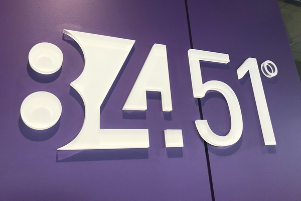
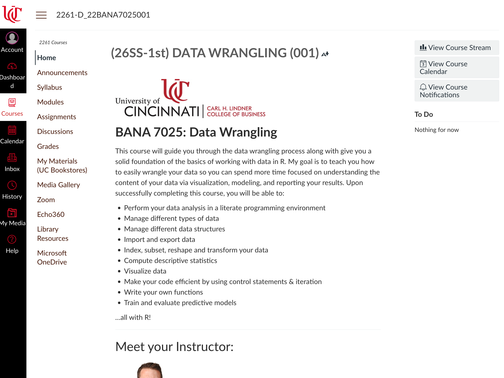
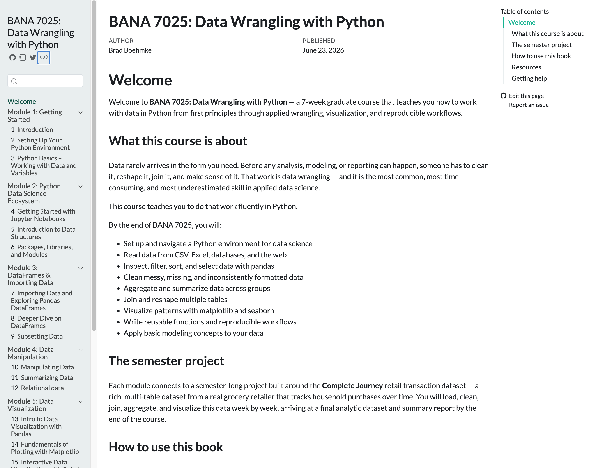
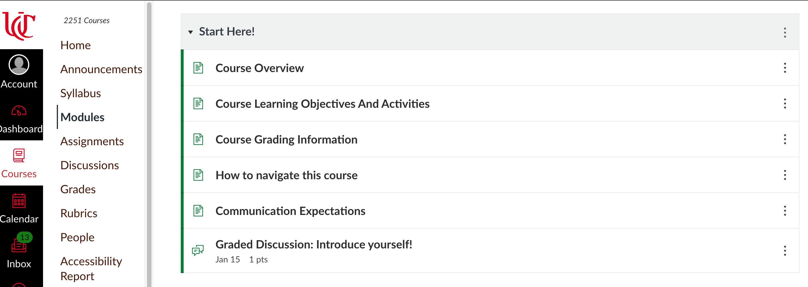
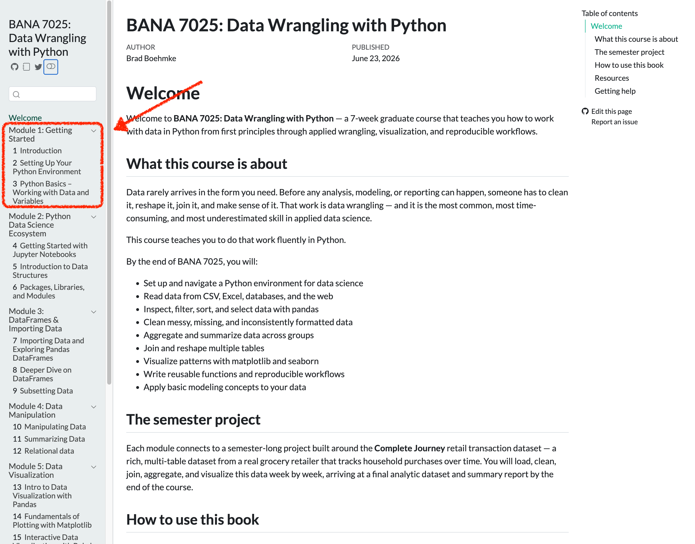

# Welcome to BANA 7025  {background="#43464B"}

## Brad Boehmke {.smaller}

<br>

::: columns
::: {.column width="60%"}
- Phonetically: **"Bem"** + **"Key"**

- Alternatives:
   - Dr. / Professor B
   - Brad

- Contact:
   - Read **Communication Expectations** Canvas page first!
   - Email: boehmkbc@ucmail.uc.edu
   - Office: Lindhall 3412
:::
::: {.column width="40%"}

:::
:::

---

<br><br><br>

:::: columns
::: {.column width="33%"}
{fig-align="center"}
:::
::: {.column width="33%"}
{fig-align="left"}
:::
::: {.column width="33%"}
{fig-align="center"}
:::
::::

---

## Fun Fact: Golf Obsessed

<br>













## Today's Agenda

<br>

- What is data wrangling and why does it matter?
- Course overview, goals, & roadmap
- AI & Tooling
- Q&A

# What is Data Wrangling  {background="#43464B"}

## The Dirty Secret of Data Science {.smaller}

> Before you can analyze data, you have to *fix* it.

**Data in the wild is messy:**

- 🧹 Missing values, duplicate records, inconsistent formats
- 🔀 Data spread across multiple files that need to be joined
- 📐 Columns that need to be renamed, reshaped, or recalculated
- 🗓️ Dates stored as text, numbers stored as strings


<br>

::: {.callout-important}
[Studies consistently show data scientists spend **50–80% of their time** cleaning and preparing data — not modeling.]{style="color:blue;"}
:::

## What Is Data Wrangling? {.smaller}

> **The process of cleaning, transforming, summarizing, and visualizing data to extract meaningful insights**

```{mermaid}
%%| fig-align: center
flowchart LR
  A[Raw Data] --> B[Clean]
  B --> C[Transform & Aggregate]
  C --> D[Join & Reshape]
  D --> E[Visualize & Summarize]
  E --> F[Insight]
```

It's the full skill of working with data end-to-end — from fixing a messy import to building a chart that tells a story.

::: {.callout-important}
[Data wrangling is not a detour on the way to analysis — **it is the work**.]{style="color:blue;"}
:::

## Data Wrangling is All Around Us {.smaller}

::: {.callout-important}
[No ML model, optimization system, or AI tool works without clean, prepared data first.]{style="color:blue;"}
:::

- 🛒 *Kroger* must join loyalty card transactions with product catalogs and household profiles **before** building a personalized coupon recommendation system
- 🏥 *Hospitals* must clean, reshape, and aggregate patient records across departments **before** training readmission prediction models
- 📦 *Amazon* must transform raw clickstream logs into structured, summarized features **before** any recommendation algorithm can run
- 🏈 *NFL teams* must merge and wrangle player tracking data from dozens of sources **before** building performance optimization models
- 📊 *Finance teams* must reconcile, clean, and reshape data from disparate systems **before** fraud detection or forecasting models can be built


# Why Should You Care? {background="#43464B"}

## Meet Taylor {.smaller}

:::: {.columns}
::: {.column width="65%"}
**Taylor** is a graduating M.S. in Business Analytics student who just landed her first full-time role at a retail analytics firm.

**Taylor has a solid foundation:**

- Statistics and modeling knowledge ✓
- Business acumen ✓
- Critical thinking ✓

:::
::: {.column width="35%"}
{fig-align="center"}
:::
::::

Taylor knows how to think about data!

## Taylor's First Week on the Job {.smaller}

:::: {.columns}
::: {.column width="65%"}
The manager drops three raw data files and says:

> *"We're trying to understand what drives repeat purchases. Can you clean this up and pull together something useful by Friday?"*

**Taylor opens the files and freezes.** 😰

:::
::: {.column width="35%"}
{fig-align="center"}
:::
::::

**What's missing?** The hands-on ability to take raw, messy files and wrangle them into something ready for analysis.

<br>

::: {.callout-important}
[**That gap is exactly what this course closes.**]{style="color:blue;"}
:::

# Does this scenario sound familiar?  {background="#43464B"}

## It's your turn to experience this... {.smaller}

:::: {.columns}
::: {.column}
You'll get three datasets:

- 🧾 **Customer Transactions** (messy!)
- 🛒 **Product Information**
- 👥 **Customer Demographics**

:::
::: {.column}
<center>
Download the data from

[https://tinyurl.com/retail-data](https://tinyurl.com/retail-data)
</center>
:::
::::

**Your mission:** 

1. Get this data into a form where you can start answering: *"What drives repeat purchases?"*
2. Can you get some initial insights from the data?


## Group Activity: Dig Into the Data {.smaller}

:::: {.columns}
::: {.column}
Work in groups of 2–3. Use any tools you have (Excel, Python, intuition) and try to answer:

- 🛒 Which products have the highest repeat purchase rate?
- 👥 Are certain types of customers buying these products more frequently?
- 📅 Is there a time pattern — do repeat purchases cluster around certain days or weeks?
- 🧹 What data quality issues did you run into? Missing values? Inconsistent formats?
- 🔀 How did you connect information across the three files?
:::
::: {.column}

<center>
Please work on this for 15 minutes.

<div id="15minWaiting"></div>
<script src="_extensions/produnis/timer/timer.js"></script>
<script>
    document.addEventListener("DOMContentLoaded", function () {
        initializeTimer("15minWaiting", 900, "slide");
    });
</script>
</center>

:::
::::

::: {.callout-important}
Don't worry about getting the "right" answer — focus on what's hard about the process.
:::

## Debrief: What Did You Learn? {.smaller}

Let's talk through what you found:

- 🛒 Were you able to identify which products had the highest repeat purchase rate? What made it hard?
- 👥 Did any customer segments stand out? How did you figure that out?
- 📅 Did you find any time patterns — and how did you look for them?
- 🧹 What data quality issues slowed you down?
- 🔀 How did you connect the three files — and what would have helped?

::: {.callout-tip}
If you couldn't complete the task — or didn't know where to start — **that's exactly the point.** By the end of this course, this will feel straightforward.
:::

## Key Takeaways:

- Real-world data is never clean or ready to analyze
- Good data work starts with **understanding the structure and quality** of your data
- This course will teach you to **clean, reshape, join, transform, and start analyzing** data with Python

::: {.callout-tip}
*We'll revisit this exact challenge at the end of the semester — and it'll feel completely different.*
:::

# Course Overview  {background="#43464B"}

## Why Data Wrangling for YOUR Career {.smaller}

Regardless of where your career takes you, one thing is constant: **you will work with data**.

- 📊 **M.S. Business Analytics** → Data wrangling is the foundation every model, dashboard, and insight is built on
- 💻 **M.S. Information Systems** → Integrating and preparing data across systems is a core technical skill
- 🤖 **Certificate in AI** → Clean, well-structured data is what separates working AI systems from broken ones
- 🎯 **Any advanced degree** → Employers increasingly expect you to get your hands on data — not just interpret results someone else prepared

. . .

Being able to do this **with code** is a key differentiator!

::: {.callout-important}
[The bottleneck in most organizations is not analysis — **it's getting data ready for analysis**.]{style="color:blue;"}
:::

## What You'll Learn in BANA 7025 {.smaller}

```{mermaid}
%%| fig-align: center
flowchart LR
  A[Raw Data] --> B[Import & Inspect]
  B --> C[Clean]
  C --> D[Wrangle]
  D --> E[Join & Reshape]
  E --> F[Visualize]
  F --> G[Insight]
```

By the end of this course, you'll be able to:

- Write Python code to import and inspect data from multiple sources
- Clean messy data: handle missing values, fix types, standardize formats
- Transform, filter, sort, group, and aggregate data with pandas
- Join multiple tables and reshape data for analysis
- Visualize data clearly and effectively
- Write reusable functions to automate data preparation tasks

. . .

::: {.callout-important}
[Most courses in your program focus on the **Insight** box — applying models to extract answers. This course builds everything that makes those models possible and their results trustable.]{style="color:blue;"}
:::

# AI Reality Check {background="#43464B"}

## What About AI? Won't It Do This for Me? {.smaller}

> *"Why do I need to learn data wrangling when ChatGPT can just clean my data?"*

It's a fair question. Let's talk about it honestly.

:::: {.columns}
::: {.column width="65%"}
🤖 **AI tools are incredible accelerators**, but they're not magic:

- They don't **understand your data's context or meaning**
- They can't **catch errors they don't know to look for**
- They sometimes just **make stuff up**
- They're only as good as **your prompts and judgment**
:::
::: {.column width="35%"}
{fig-align="center"}
:::
::::

## AI Reality Check: It's Like Autocorrect for Code! {.smaller}

::: {.callout-warning}
**Ever had your phone turn "on my way!" into "omg my weasel!"?** 🦫

That's exactly how AI coding tools work — they predict what comes next based on patterns they've seen.

Sometimes they nail it... sometimes you get digital weasels.
:::

. . .

**AI tools are assistants, not autopilots:**

:::: {.columns}
::: {.column}
✅ **AI can help you:**

- Write boilerplate code
- Debug errors
- Learn new syntax
- Generate ideas
:::
::: {.column}
❌ **AI cannot:**

- Understand YOUR data
- Know YOUR business goals
- Spot problems it wasn't told about
- Guarantee correct results
:::
::::

## How We'll Use AI in This Course {.smaller}

You'll learn to use AI tools **as learning partners, not crutches:**

::: {.columns}
::: {.column}
**✅ Smart AI Use:**

- Check your understanding
- Help debug when stuck
- Explain concepts differently
- Generate practice examples
- **Always understand what the code does**
:::
::: {.column}
**❌ Avoid This:**

- Copy-paste without understanding
- Skip the learning struggle
- Rely on AI for everything
- Submit AI code you can't explain
:::
:::

. . .

::: {.callout-important}
[The future belongs to people who know how to **collaborate with AI**, not be replaced by it.]{style="color:blue;"}
:::

# Course Roadmap & Learning Mindset {background="#43464B"}

## Learning to Code: A Reality Check {.smaller}

**Let's be honest** — learning to code can be frustrating at first.

:::: {.columns}
::: {.column}
**You might feel:**

- 😤 Confused by error messages
- 🤯 Like everyone else "gets it" but you
- 😮‍💨 Stuck on simple problems
- 🙄 Like you're just copying examples

**This is normal. It's expected.**
:::
::: {.column}
{fig-align="center"}
:::
::::

. . .

::: {.callout-tip}
## Learning to Code = Learning a New Language

You'll start by copying examples and ~~Googling~~ ChatGPTing errors.

Over time, you'll stop memorizing and start **thinking** in code.
:::

**This course is designed for beginners** — we'll get you there step by step!

# Course Roadmap  {background="#43464B"}

## Course Roadmap {.smaller}

Your 7-week journey through BANA 7025 looks roughly like this:

| Week | Topic | Summary of Concepts Covered |
|------|-----------|-----------------------------|
| 1 | Fundamentals I | Coding environment setup, Python basics |
| 2 | Fundamentals II | Jupyter notebooks, data structures, Python libraries |
| 3 | Pandas & Data Wrangling I | Importing, subsetting, cleaning, filtering data |
| 4 | Pandas & Data Wrangling II | Aggregating, merging, and joining data |
| 5 | Data Visualization | Plotting libraries & exploratory data analysis |
| 6 | Efficient Code | Control flow & writing functions |
| 7 | Intro to ML | Intro to ML with scikit-learn |

::: {.callout-important}
[Each week builds on the last — by week 7, you'll have a complete data wrangling workflow.]{style="color:blue;"}
:::

## How You'll Learn {.smaller}

Each week follows a consistent rhythm:

- 🧠 **Tuesday (Lecture):** Learn concepts, explore examples, discuss ideas
- 💻 **Thursday (Lab):** Practice coding, get hands-on, work with real data

Assessments include:

- 📚 Weekly reading quizzes
- 📝 Homework assignments
- 💭 Discussion forums
- 📊 Final project

::: {.callout-important}
[Expect to build something meaningful — not just learn theory.]{style="color:blue;"}
:::

## Resources {.smaller}

Everything You Need Is in One of Two Spots


<br>

::: {.columns}
::: {.column width="50%"}

#### 📍 Course Canvas Page

{fig-align="center"}

:::

::: {.column width="50%"}

#### 📘 Course Textbook

{fig-align="center"}

:::
:::

:::footer
Book: [https://bradleyboehmke.github.io/uc-bana-7025/](https://bradleyboehmke.github.io/uc-bana-7025/)
:::

## Step 1

::: {.callout}
Who has read through the ["Start Here!"]{style="color:red;"} module?
:::



. . .

::: {.callout}
Let's hit on a few important items
:::

# Tools & Setup Preview  {background="#43464B"}

## Why Learn to Code? 🤔

. . .

:::: {.columns}
::: {.column}

<br>

- Coding = flexibility + power
- Handle real-world data: big, messy, inconsistent
- Automate repetitive tasks
- Think algorithmically and analytically
:::
::: {.column}

:::
::::


## Why Python? 🤔 {.smaller}

:::: {.columns}
::: {.column}

<br>

- Widely used
- Easy-to-read syntax (great for beginners)
- Massive ecosystem: pandas, numpy, matplotlib, scikit-learn
- Community support: tutorials, libraries, AI tools
- **Most organizations are shifting toward Python** as the primary language for their **data science and engineering codebases**

:::
::: {.column}

{width="75%" fig-align="center"}

:::
::::

::: {.callout-important}
Python is the most valuable tool in your analytics toolbox.
:::

## How You'll Run Python: Google Colab {.smaller}

:::: {.columns}
::: {.column width="60%"}
#### What is Colab?

- 💻 Free cloud-based Python environment from Google
- 🚫 No software installation needed to get started
- ✅ Works in your browser – just click and code

#### Why Colab First?

- Easy, consistent experience for everyone on Day 1
- Allows us to focus on learning — not debugging installs
- We'll gradually move toward installing tools locally (e.g., Anaconda, VS Code)
:::
::: {.column width="40%"}

:::
::::

::: {.callout-important}
You'll be up and coding on Day 1 — no setup headaches!
:::

# Next Steps  {background="#43464B"}

## Your Learning Journey Starts Now {.smaller}

**📖 What Next?**

:::: {.columns}
::: {.column width="60%"}
1. Read the "Start Here!" module on Canvas
2. Work through **Chapters 1–3** this week
3. Get up and running in Colab

**🗓️ Thursday Lab:**

- Your **first Python code**
- Working in **Google Colab**
- **Collaborative problem-solving**

**💡 Remember:** We're building skills step-by-step!
:::
::: {.column width="40%"}

:::
::::


# Q&A  {background="#43464B"}

## Q&A 🙋‍♀️

- Open floor for any questions regarding the course structure, expectations, or content.
- Discussion on how this course aligns with your academic and career goals.
- Or anything else...golf?
