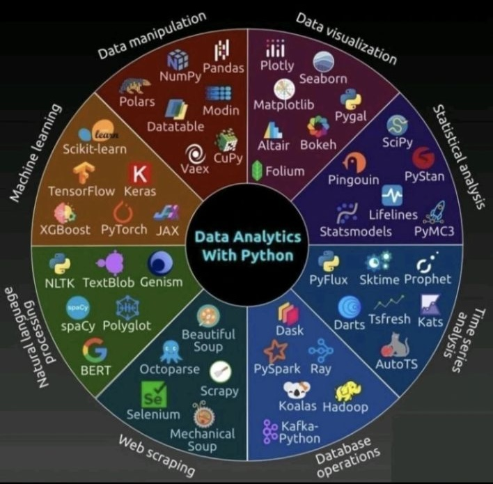

# 🔁 Recap  {background="#43464B"}

## Week 1: What Do You Remember 🤔

::: {.incremental}
- What is the best sport in the world?
- Why is data mining important?
- Why learn coding with Python?
- What is a variable?
- What are Python’s basic data types?
- Where do we write and run Python code?
:::


## Think-Pair-Share {.smaller}

<br><br>

:::: {.columns}
::: {.column width="70%"}
> Discuss with a neighbor (2–3 min):
>
> - What’s one thing that stood out from last week?
> - What’s one thing that confused you?
:::
::: {.column width="30%"}

<center>

<div id="3minWaiting"></div>
<script src="_extensions/produnis/timer/timer.js"></script>
<script>
    document.addEventListener("DOMContentLoaded", function () {
        initializeTimer("3minWaiting", 180, "slide"); 
    });
</script>
</center>

:::
::::

Then we’ll take a few responses...


# Agenda {background="#43464B"}

---

<br><br>

1. Jupyter Notebooks – How we organize our analyses
2. Data Structures – How we organize data
3. Packages & Libraries – How we expand Python
4. In-Class Activities & Discussion

# 📓 Jupyter Notebooks {background="#43464B"}

## 🧠 Think-Pair-Share: Data Analysis Reality {.smaller}

Your manager gives you customer data and asks for a report by Friday that:

1. **Explains the business problem** clearly
2. **Shows your analytical process** step-by-step  
3. **Presents results** with visualizations
4. **Provides actionable recommendations**
5. **Can be updated** when new data arrives next month

. . .

:::: {.columns}
::: {.column width="70%"}
**How would you approach this *before* this class?**

⏳ You have 2–3 minutes — chat with a neighbor!
:::
::: {.column width="30%"}

<center>

<div id="3minWaitingAgain"></div>
<script src="_extensions/produnis/timer/timer.js"></script>
<script>
    document.addEventListener("DOMContentLoaded", function () {
        initializeTimer("3minWaitingAgain", 180, "slide"); 
    });
</script>
</center>
:::
::::

## 📊 Data Analysis: Before vs After Jupyter {.smaller}

:::: {.columns}
::: {.column width="50%"}
**❌ Traditional Workflow Problems**

```
Excel Analysis
    ↓
Screenshot Charts  
    ↓
Word Document
    ↓
Email to Boss
    ↓
"Can you update this?"
    ↓
Start over! 😱
```

- Manual copy/paste errors
- No audit trail
- Hard to reproduce
- Version control nightmare
:::

::: {.column width="50%"}
**✅ Jupyter Notebook Solution**

```
Data + Code + Narrative
         ↓
Single Document
         ↓
Export & Share
         ↓
"Update with new data?"
         ↓
Re-run notebook! 🎉
```

- Automatic documentation
- Reproducible analysis  
- Version controlled
- Professional presentation
:::
::::

## 📓 Why Jupyter Notebooks Transform Data Analysis {.smaller}

**From the textbook:** *"In data science, we don't just write code — we tell stories with data"*

<br>

:::: {.columns}
::: {.column width="33%"}
**🔬 Exploratory-Friendly**

- Test ideas in chunks
- See immediate results  
- Iterate quickly
- Perfect for "what if?"
:::

::: {.column width="33%"}
**📝 Code + Context**

- Explain your thinking
- Document methodology
- Combine analysis + story
- Reproducible research
:::

::: {.column width="33%"}
**📊 Shareable & Visual**

- Inline plots & tables
- Export to HTML/PDF
- Complete analysis package
- Stakeholder-ready
:::
::::

<br>

**Bottom line:** Notebooks let you explore, document, and communicate all in one place!


## 🧱 Notebook Building Blocks {.smaller}

**From your reading:** Notebooks combine two cell types for complete analysis documentation   <a href="https://colab.research.google.com/github/bradleyboehmke/uc-bana-4080/blob/main/example-notebooks/03_jupyter_notebook_basics.ipynb" target="_parent"></a>

:::: {.columns}
::: {.column width="50%"}
**📝 Markdown Cells**

- **Business context:** Explain the problem
- **Methodology:** Describe your approach  
- **Insights:** Interpret results
- **Recommendations:** What should we do?

<br>

*Like the narrative in a business report*
:::

::: {.column width="50%"}
**🐍 Code Cells**

- **Data loading:** Import customer data
- **Analysis:** Calculate key metrics
- **Visualization:** Create charts/tables
- **Validation:** Test assumptions

<br>

*Like the calculations in a spreadsheet*
:::
::::

<br>

**The Magic:** These work together to create professional, reproducible analysis reports!


## 📋 How to Organize a Good Notebook {.smaller}

**From your textbook:** *"Structure your notebook like a story—introduce the goal, describe your approach, show the results, and summarize your findings"*

. . .

:::: {.columns}
::: {.column width="50%"}
**📝 Content Organization**

- **Clear title** with date and analyst name
- **Executive summary** (1-2 sentences)
- **Business problem** section with questions
- **Methodology** explaining your approach
- **Analysis** with code and results
- **Key findings** highlighting insights
- **Recommendations** with next steps
:::

::: {.column width="50%"}
**✅ Formatting Best Practices**

- **Descriptive file names:** `customer_churn_analysis_2024.ipynb`
- **Markdown headers** to create clear sections
- **Explain your thinking,** not just your code
- **Include business context** and assumptions
- **Professional writing** with proper grammar
- **Export to HTML/PDF** for sharing
:::
::::

**Goal:** Anyone should be able to understand your analysis and reproduce your results!

## 📋 Example: Well-Organized Notebook {.smaller}

**Let's see good organization in action:** [Example Notebook: https://tinyurl.com/4sfvm3a8](https://github.com/bradleyboehmke/uc-bana-4080/blob/main/example-notebooks/example_notebook.ipynb)

. . .

<br>

:::: {.columns}
::: {.column}
 ✅ **Clear structure**

- Logical flow from problem to solution
- Professional format

✅ **Business focused**

- Executive summary up front
- Actionable recommendations
:::
::: {.column}
✅ **Reproducible**

- Methodology clearly explained
- Data sources documented

✅ **Stakeholder ready**

- No technical jargon in findings
- Ready to export and share
:::
::::


<br>

::: {.callout-tip}
This could be presented to executives or shared with colleagues!
:::

## 📋 Example: Homework Notebook {.smaller}

Let's look at another good example, this time at what a **well organized homework notebook** could look like: [Example Homework Notebook: https://tinyurl.com/mss2adzs](https://github.com/bradleyboehmke/uc-bana-4080/blob/main/example-notebooks/example_homework_notebook.ipynb)


## ⚠️ Avoiding Common Pitfalls {.smaller}

**From your textbook:** *"Code is executed in the order you run the cells, not necessarily from top to bottom"*

**🚨 The #1 Notebook Problem: Execution Order Issues**  <a href="https://colab.research.google.com/github/bradleyboehmke/uc-bana-4080/blob/main/example-notebooks/03_jupyter_notebook_basics.ipynb" target="_parent"></a>

. . .

:::: {.columns}
::: {.column}
**Problems this creates:**

- “Works on my machine”
- Unreproducible results
- Hidden dependencies
- Confused teammates
:::
::: {.column}
**✅ How to Avoid This:**

- **"Restart and Run All"** before sharing
- Keep cells in **logical order** (top to bottom)
- **Clear outputs** before committing
- Test with **fresh kernel** regularly
:::
::::

. . .

::: {.callout}
## Professional Standard

Your notebook should work perfectly when run from top to bottom with a clean kernel!
:::


## 🙋‍♀️ Questions & Discussion {.smaller}

**Open floor for any questions about Jupyter notebooks:**

- Organizing professional analysis reports
- Best practices for reproducible research
- Cell execution and kernel management
- Markdown formatting and documentation
- Sharing notebooks with stakeholders


<br>

*Let's make sure everyone feels confident with notebooks before moving to data structures!*


# Python Data Structures {background="#43464B"}

## Why Do We Care? {.smaller}

Last week, we worked with **individual data types** like:

- `int` for numbers  
- `float` for decimals  
- `str` for text

. . .

But in real-world analyses, we usually need to work with **collections** of values.

- A list of product names  
- A mapping of customer IDs to sales  
- A set of unique email addresses  

::: {.callout-important}
This is where **data structures** come in. **Data structures help us organize values.** 
:::

## 🧠 Think-Pair-Share: Data Mgt {.smaller}

**Scenario:** You work for a subscription service with this customer data:

- **Monthly subscribers:** 1,250 people
- **Customer information:** names, signup dates, plan types  
- **Need to track:** renewals, cancellations, upgrades
- **Important:** Some data should NOT be editable (e.g., signup dates); other data should not be duplicated (e.g. customer ID)

. . .

**Questions to discuss (4 minutes):**

1. How would you organize this data in Excel?
2. What challenges might you face as the business grows?
3. How would you prevent accidental changes to signup dates?
4. What if you need to frequently look up customers by name or ID?


## 🏢 Data Structures in Business Analytics {.smaller}

**Let's see how Python data structures solve these Excel challenges:**

:::: {.columns}
::: {.column width="50%"}
**❌ Excel Challenges**
```
Multiple sheets for different data
Manual copy/paste between tabs
No protection for critical fields  
Lookup formulas get complex
Hard to automate workflows
```

- Prone to human error
- Difficult to scale
- Limited automation
:::
::: {.column width="50%"}
**✅ Python Data Structures**
```python
# Customer profiles (protected data)
customers = {
    "sarah": {"signup": "2023-01-15", "plan": "premium"},
    "mike": {"signup": "2023-02-20", "plan": "basic"}
}

# Activity tracking (changeable data)
renewals = ["sarah", "mike", "alex"]
```

- Built-in data protection
- Fast lookups and updates
- Easy to automate
:::
::::

::: {.callout}
## The Question

Which Python structure fits each business need?
:::


## 🗂️ The Four Main Data Structures {.smaller}

**Python gives us four powerful (built-in) tools to organize business data:**

<br>

| Structure  | Best For                    | Business Example                           | Key Feature          |
| ---------- | --------------------------- | ------------------------------------------ | -------------------- |
| **List**   | Ordered sequences           | Daily sales figures, customer queue       | Order matters        |
| **Tuple**  | Fixed, protected data       | Store coordinates, product dimensions      | Cannot be changed    |
| **Set**    | Unique values only          | Email subscribers, product categories      | No duplicates        |
| **Dictionary** | Lookups & labeled data  | Customer profiles, product catalog         | Key-value pairs      |

<br>

::: {.callout-tip}
**The Goal:** Match your data's **behavior** to the right **structure**
:::

## Which One Matters {.smaller}

<br>

Choosing the right one makes your code:

- Easier to write  
- Faster to run  
- Simpler to understand

<br>

For example...

## Example 1: Dictionary {.smaller}

<br>

🔎 **Goal**: You need to **look up a product price** by name.

```python
prices = {"apple": 0.99, "banana": 0.59}
```

<br>

* This is a **dictionary** (`dict`)
* It uses **key–value pairs** surrounded by `{}`
* Keys are `"apple"`, `"banana"`; values are prices

::: {.callout-important}
✅ A dictionary allows **fast key-based lookup**.

📌 Use when you need to map one thing (e.g. name) to another (e.g. price).
:::

## Example 2: Tuple {.smaller}

<br>

📍 **Goal**: You’re storing a **GPS coordinate** that should never change.

```python
location = (39.76, -84.19)
```

<br>

* This is a **tuple**
* Ordered, but **immutable** (cannot be changed)
* Surrounded by `()` and contains values in sequence

::: {.callout-important}
✅ A tuple **protects data from being changed accidentally**.

📌 Use when data is **fixed** and position matters.
:::

## Example 3: List {.smaller}

<br>

🎧 **Goal**: You’re storing **songs in a playlist**, in order.

```python
playlist = ["Intro", "Track 1", "Track 2"]
```

<br>

* This is a **list**
* Ordered and **mutable** (can add/remove/change items)
* Uses `[]` brackets for creation

::: {.callout-important}
✅ A list lets you **store sequences of items and modify them easily**.

📌 Use when order matters and you'll be changing the contents.
:::

## Example 4: Set {.smaller}

<br>

📧 **Goal**: You're collecting **unique email addresses** for a newsletter, no duplicates allowed.

```python
subscribers = {"john@email.com", "sarah@email.com", "mike@email.com"}
```

<br>

* This is a **set**
* **Unordered** but **mutable** (can add/remove items)
* Uses `{}` brackets but NO key-value pairs (just values)
* **Automatically removes duplicates**

::: {.callout-important}
✅ A set **ensures all items are unique** and provides fast membership testing.

📌 Use when you need to eliminate duplicates or check "is this item in the collection?"
:::

## Foundational Built-In Data Structures {.smaller}

<br>

| Type       | Ordered? | Mutable? | Use For                         |
| ---------- | -------- | -------- | ------------------------------- |
| List       | ✅        | ✅        | Sequence of items               |
| Tuple      | ✅        | ❌        | Fixed data, like coordinates    |
| Set        | ❌        | ✅        | Unique items                    |
| Dictionary | ❌        | ✅        | Key–value pairs (like a lookup) |

<br>

::: {.callout-tip}
- Use a **list** when order matters
- Use a **tuple** when the data shouldn't change
- Use a **set** when uniqueness matters
- Use a **dict** when you need to *look something up*
:::

## 🎯 Business Decision Framework {.smaller}

**When choosing a data structure, ask yourself:**

1. **Do I need to look things up by name/ID?** → Dictionary
2. **Is the order of items important?** → List or Tuple  
3. **Will the data change over time?** → List (if yes), Tuple (if no)
4. **Do I need only unique values?** → Set


<br>

::: {.callout-important}
**Key Insight:** The right structure makes your analysis **faster, clearer, and more maintainable!**
:::

## 🔍 Examples in Action {.smaller}

**💼 Real Business Examples:**

- **Customer profiles** → Dictionary (lookup by ID)
- **Sales timeline** → List (ordered, growing)  
- **Store location** → Tuple (fixed coordinates)
- **Email subscribers** → Set (unique emails only)

<br> 

```python
# Dictionary: Customer lookup
customers = {"C001": {"name": "Sarah", "plan": "Premium"}}

# List: Daily sales (order matters, data grows)
daily_sales = [1250, 980, 1340, 2100, 890]

# Tuple: Store location (fixed, never changes)
headquarters = (39.76, -84.19)  # Cincinnati coordinates

# Set: Unique email subscribers (no duplicates)
subscribers = {"john@email.com", "sarah@email.com", "mike@email.com"}
```


## Summary: Data Structures Matter {.smaller}

<br>

Choosing the right structure makes your code:

* Easier to write and read
* More efficient
* Better aligned to the task

You'll explore these structures more in depth this week and you'll get practice:

1. choosing the right one
2. creating these data structures
3. accessing and modifying items inside them


## 🧠 Mini Challenge - Pick the Structure {.smaller}

**You're a data analyst at different companies. Choose the best data structure for each scenario:**

:::: {.columns}
::: {.column width="50%"}
**Scenario 1: Social Media Startup** 📱
You need to track trending hashtags from user posts, but each hashtag should only appear once in your analysis, regardless of how many times it's used.

**Scenario 2: E-commerce Platform** 🛒
You're tracking daily website traffic for the past 30 days to identify patterns. The order of days is crucial for trend analysis, and you'll be adding new days as they occur.
:::
::: {.column width="50%"}
**Scenario 3: Restaurant Chain** 🍕
You need to store the GPS coordinates of your flagship restaurant location. This data will never change and is critical for delivery mapping software.

**Scenario 4: University System** 🎓
You're building a student lookup system where professors can quickly find a student's information (name, major, GPA) using their student ID number.
:::
::::

<br>

🤔 **Work with a partner (3 minutes):** What structure would you use for each scenario—and why?


# 📦 Packages, Libraries & Modules {background="#43464B"}

## Python Ecosystem

- Python is great, but not perfect out of the box
- We use **modules**, **libraries**, and **packages** to add features

::: {.callout-tip}
Python’s true power comes from its ecosystem of **packages, libraries, and modules** that extend its core functionality
:::

## 🤔 Build from Scratch or Reuse? {.smaller}

If you needed to calculate the **correlation between two variables (x and y)**

```{python}
x = [2, 4, 7, 8, 10, 11, 14, 13]
y = [1, 3, 5, 7, 10, 9, 13, 13]
```

would you rather...

::::{.columns}
::: {.column width="50%"}

**🛠️ Build It Yourself**

```{python}
#| echo: true
mean_x = sum(x) / len(x)
mean_y = sum(y) / len(y)

numerator = sum((a - mean_x)*(b - mean_y) for a, b in zip(x, y))
denominator = (
    sum((a - mean_x)**2 for a in x) *
    sum((b - mean_y)**2 for b in y)
) ** 0.5

correlation = numerator / denominator
print(f"correlation = {correlation}")
```

:::

::: {.column width="50%"}

**🤖 Use a Library**

```{python}
#| echo: true
import numpy as np

correlation = np.corrcoef(x, y)[0, 1]
print(f"correlation = {correlation}")
```

:::
::::

::: {.callout-important}
✅ **Packages** like `numpy` help us reuse reliable, optimized code

📌 They save time, reduce bugs, and make your code easier to read
:::

## Python Ecosystem

::: {.callout-tip}
Python’s true power comes from its ecosystem of **packages, libraries, and modules** that extend its core functionality
:::

{fig-align="center"}

## Vocabulary {.smaller}

There are terminology differences between...

- **Module**: A single .py file that contains Python code—functions, variables, classes—that you can reuse. For example, the math module lets you do mathematical calculations.
- **Library**: A collection of related modules bundled together. For example, pandas is a library that includes several modules for data manipulation.
- **Package**: A directory containing one or more modules or libraries, with an __init__.py file that tells Python it’s a package. You can think of a package as the container that holds libraries and modules.

::: {.callout-important}
But I'm not hung up in you knowing these differences at this time.  More importantly, I want you to understand the following...
:::

## 🛠️ Standard vs. Third-Party {.smaller}

- **Standard Library** – comes with Python (`math`, `datetime`)
- **Third-Party Libraries** – must install (`numpy`, `pandas`, `seaborn`)

:::: {.columns}
::: {.column}
**Standard Library**

```{python}
#| echo: true
import random
random.randint(1, 10)
```

<br>

```{python}
#| echo: true
import datetime
print(datetime.date.today())
```

:::
::: {.column}
**Third-Party Library**

```python
# must first install (typically from PyPI)
pip install numpy   # command line
!pip install numpy  # jupyter notebook
```
<br>

```{python}
#| echo: true
import numpy as np

np.mean([1, 2, 3, 4, 5, 6, 7, 8, 9, 10])
```

:::
::::


## 🛠️ Standard vs. Third-Party {.smaller}

- **Standard Library** – comes with Python (`math`, `datetime`)
- **Third-Party Libraries** – must install (`numpy`, `pandas`, `seaborn`)

:::: {.columns}
::: {.column}
**Standard Library**

* Already installed with Python
* [Lots of functionality](https://docs.python.org/3/library/index.html)
  * `os`
  * `math`
  * `itertools`
  * `functools`
  * `random`: 
  * `pickle`
  * `datetime` 
  * etc.

:::
::: {.column}
**Third-Party Library**

* Must be installed
* Python Package Index (PyPI - https://pypi.org/)
  * `numpy`
  * `pandas`
  * `matplotlib`
  * `seaborn`
  * `scikit-learn`
  * 650,000+ pkgs on PyPI!!! 
  

:::
::::

## 🧠 Library Scavenger Hunt {.smaller}

:::: {.columns}
::: {.column width="70%"}
In 5 minutes, find:

- 1 standard library
- 1 third-party package
- What do they do?
- One function or method they provide

📢 Be ready to share what you found!
:::
::: {.column width="30%"}

<center>

<div id="5minWaiting"></div>
<script src="_extensions/produnis/timer/timer.js"></script>
<script>
    document.addEventListener("DOMContentLoaded", function () {
        initializeTimer("5minWaiting", 300, "slide"); 
    });
</script>
</center>

:::
::::


# Let's Wrap This Up {background="#43464B"}

## Recap: What Did We Learn?

- Jupyter helps us explore + explain
- Data structures help us organize
- Libraries help us do *more* with Python


## Next Up: Lab Time on Thursday

Hands-on practice with...

- Jupyter notebooks
- Data structures
- Practice using packages

<br>

::: {.callout-important}
Be sure to read the chapter readings **before** Thursday's lab!  And bring your questions!
:::

## Q&A 🙋‍♀️

Open floor for any questions regarding...

- Last week's content
- This week's content
- Data mining in general
- Career questions
- Etc

